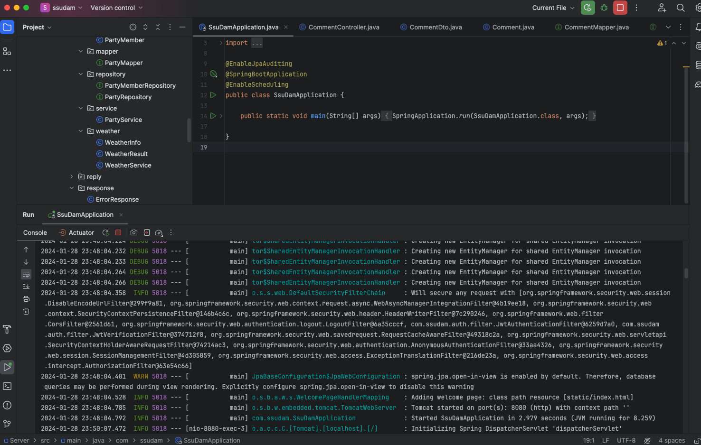
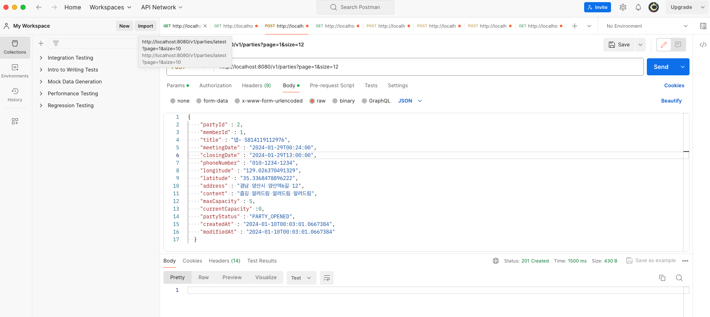
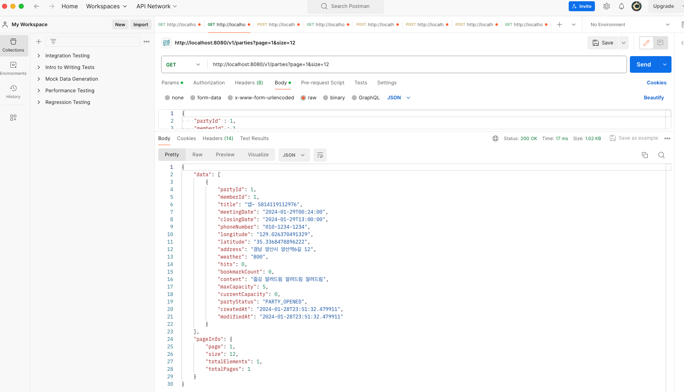

<h3>
코드스테이츠 경상남도 ABC-Lab

웹 프론트엔드 개발자 부트캠프 과정

부트캠프 기간: 2023.10.10 ~ 2024.02.06

Final Team Project

</h3>

  

<h3 align='center'> 

Let’s all flog together!
 🏃🏻쓰담 (SSEUDAM)쓰레기 담기의 줄인말로

지역 생태계 보호와 걷기를 통한 주민들의 건강 증진을 돕는 커뮤니티 사이트 </h3>

 

## 🚩 프로젝트 개요

- 팀 프로젝트 이름 : 쓰담 (SSEUDAM)
- 팀 프로젝트 기간 : 2023.12.22 ~ 2024.01.23
- 개발 인원 : 프론트엔드 4명, 백엔드 4명
- 배포주소 : [쓰담✨](http://ssdam.s3-website.ap-northeast-2.amazonaws.com/)
   
   

## 🤔 프로젝트 기획배경 / 목표

### 프로젝트 추진 계획 및 근거 / 프로젝트 기획 목표

🤔 기획 배경

1. 운동은 하고싶은데 동기가 부족하거나, 작게나마 뿌듯함을 느끼고 싶은 분들, 지역 주민들과 함께 참여하고 건강 증진을 위한 운동 기회를 제공하기 위함
2. 수업시간에 배운 기술들을 종합적으로 활용할 수 있다.

🧗 목표 및 기대 효과

1. 수업시간에 배운 내용을 바탕으로 커뮤니티 사이트 개발에 필요한 전반적인 기술 습득
2. 프로젝트 수행 과정에서 협업 능력과 문제 해결 능력 향상
3. 플로깅을 통해 사회적으로 소통하며 활동량을 높인다.
4. 환경보호와 건강을 동시에 고려하는 활동으로 사용자들에게 지속가능한 라이프 스타일의 중요성을 일깨운다.
5. 사용자들은 쓰레기 수거와 운동의 조합으로 건강한 라이프스타일을 즐기며 만족감을 느낄 수 있다.

## 👣 나의 역할

메인 페이지 담당

주요기능

1. 전체, 모집중 게시글 조회
   1. 게시글 생성시 최근 게시글, 마감일 표시
2. 새로운 모임 게시글 조회
   1. 게시글 생성시 new, 마감일 표시
3. todoList 조회
4. 관리자, 새 글쓰기, 로그인, 회원가입 페이지
   이동
   1. 로그인 했을 경우 게시글 상세조회, 새 글쓰기 가능, 비로그인시 회원가입 페이지 모달로 표시
6. 스크롤위치 표시, 스크롤 위치 입력 후 이동,
   페이지 최 상단 이동
7. 부트스트랩 반응형 레이아웃 기준 디자인 적용
   1. 스마트폰 : max-witdh 575.98px
   2. 태블릿 : max-width: 991.98px
   3. 데스크탑 : max-width: 1199.98px

## 👩‍💻👨‍💻 Team list

|                                                                 **강혜주**                                                                 |                                                                 **김수안**                                                                 |                                                                 **최준하**                                                                 |                                                                 **조은희**                                                                 |
| :----------------------------------------------------------------------------------------------------------------------------------------: | :----------------------------------------------------------------------------------------------------------------------------------------: | :----------------------------------------------------------------------------------------------------------------------------------------: | :----------------------------------------------------------------------------------------------------------------------------------------: |
|  |  |  |  |
|                                                                  BE(팀장)                                                                  |                                                                     BE                                                                     |                                                                     BE                                                                     |                                                                     BE                                                                     |
|                                                    [hyezuu](https://github.com/hyezuu)                                                     |                                                    [sooani](https://github.com/sooani)                                                     |                                                [choijh0309](https://github.com/choijh0309)                                                 |                                                  [eunhee78](https://github.com/eunhee78)                                                   |

  

|                                                                                                         **배정현**                                                                                                         |                                                                                                         **이혜원**                                                                                                         |                                                                          **안민주**                                                                           |                                                                                                                      **김윤한**                                                                                                                      |
| :------------------------------------------------------------------------------------------------------------------------------------------------------------------------------------------------------------------------: | :------------------------------------------------------------------------------------------------------------------------------------------------------------------------------------------------------------------------: | :-----------------------------------------------------------------------------------------------------------------------------------------------------------: | :--------------------------------------------------------------------------------------------------------------------------------------------------------------------------------------------------------------------------------------------------: |
|  |  |  |  |
|                                                                                                          FE(팀장)                                                                                                          |                                                                                                             FE                                                                                                             |                                                                              FE                                                                               |                                                                                                                          FE                                                                                                                          |
|                                                                                           [bjh0524](https://github.com/bjh0524)                                                                                            |                                                                                         [hyehye225](https://github.com/hyehye225)                                                                                          |                                                            [anminjoo](https://github.com/anminjoo)                                                            |                                                                                                      [YunHanKIM](https://github.com/YunHanKIM)                                                                                                       |

  

## 🛠 기술 스택

### 공통

 

### 프론트엔드

     

### 백엔드

## ⏸ 프로젝트 진행과정

#### 공통 과정

1. 사용자 요구사항 정의서, 화면 정의서 작성
2. 파트 분배
3. 폴더 구조 잡기
4. 깃 칸반 이슈 등록
5. 매일 1시에 디스코드에서 진행상황 공유하며 서로 피드백

#### 나의 과정

1. 메인페이지 헤더, 배너, 메인구역, 푸터 하드코딩을 통해 영역 설정
2. 더미데이터 및 포스트맨 활용 필요 데이터 GET, POST 확인 인텔리제이로 로컬 서버 돌리며 작업
   

3. 새로운 모임 구역 슬라이드 기능 구현

5. 전체 / 모집중 카테고리 별 게시글 구현

6. 전체 css 작업
7. 피드백 받은 내용 수정

### 시연 동영상

---

### **✔ branch 규칙**

- `main` : 메인 브랜치
- `dev` : 개발 병합 브랜치
- `be` : 백엔드 브랜치
- `be+xx` : 백엔드 개인 브랜치
- `fe` : 프론트 브랜치
- `fe+xx` : 프론트엔드 개인 브랜치

 

### 🌟 커밋 컨벤션

|        이름         |                       내용                        |
| :-----------------: | :-----------------------------------------------: |
|       ✨ feat       |                 새로운 기능 추가                  |
|       🐛 fix        |                     버그 수정                     |
|       📝 docs       |                     문서 수정                     |
|     💡 comment      |             필요한 주석 추가 및 변경              |
|      🎨 style       | 코드 포맷팅, 세미콜론 누락, 코드 변경이 없는 경우 |
|     ♻️ refactor     |                   코드 리팩토링                   |
|      🔧 update      |               코드 업데이트 및 수정               |
|       ✅ test       |                    테스트 코드                    |
|      📦 chore       |        빌드 업무 수정, 패키지 매니저 수정         |
|      🔥 remove      |            파일을 삭제하는 작업만 수행            |
|      🚚 rename      |        파일 혹은 폴더명을 수정하거나 옮김         |
|     🚑 !HOTFIX      |             급하게 치명적인 버그 고침             |
| 💥 !BREAKING CHANGE |                  커다란 API 변경                  |
